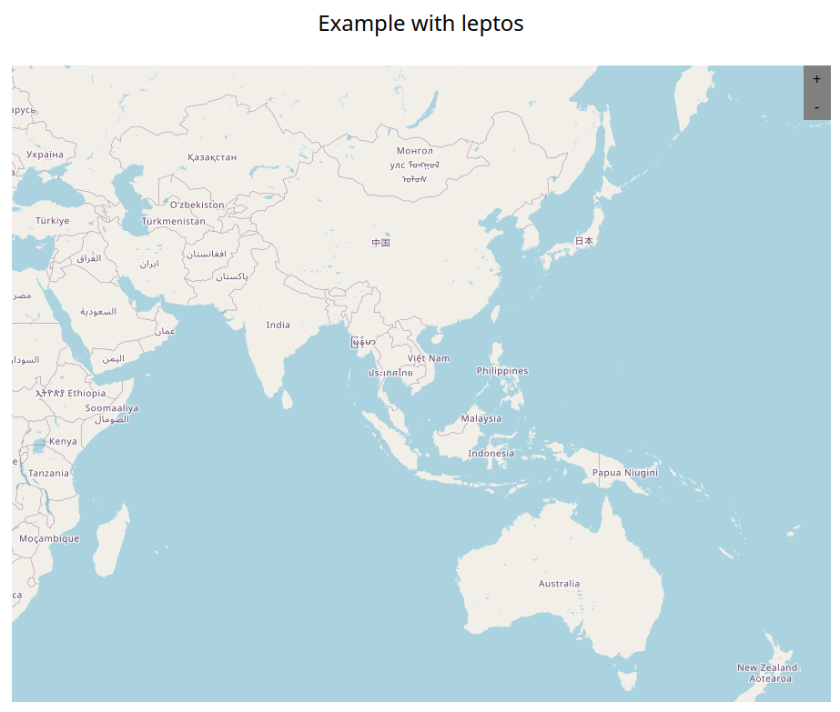

# Kapta

Inspired by leaflet

## Examples and Usage

### Integrate leptos

#### Cargo.toml

```toml
kapta = {version = "0.0.2"}
leptos_kapta = {version = "0.0.2"}
leptos = {version = "0.5"}
```

#### main.rs

```rust
use leptos::*;
use leptos_kapta::{Kapta, KaptaCoord};

fn main() {    
    mount_to_body(|| leptos::view! { <App/> })
}

#[component]
pub fn App() -> impl IntoView {
    let center: KaptaCoord = KaptaCoord::new(106.645, 10.788);
    view! {
        <div class="mx-auto">
            <h1 class="text-center m-8 text-2xl ">Example with leptos</h1>
            <div class="flex justify-center">
                <Kapta zoom=3 width=900 height=700 center=center/>
            </div>
        </div>
    }
}
```

#### Result



## Currently the library is in the development stage
